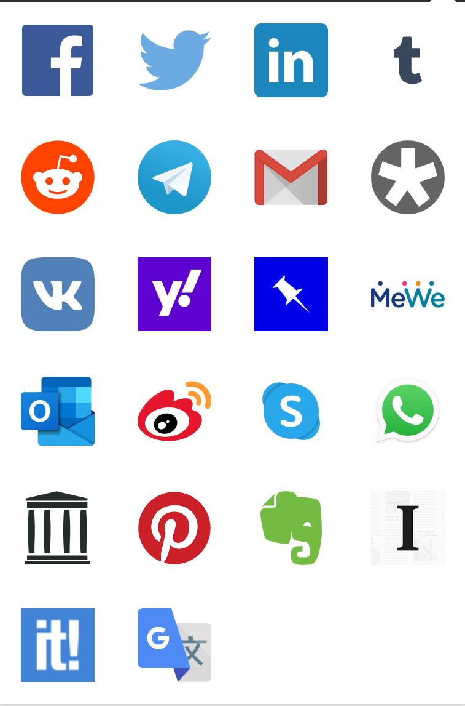

# Share Backported

Firefox Nightly 57 [removed](https://bugzilla.mozilla.org/show_bug.cgi?id=1388902) the share feature because it was using a non official API.

This extension reimplement the feature with the same previous icon with the support for Facebook, Twitter, LinkedIn, Reddit, Tumblr, GMail, Diaspora, Telegram, VKontakte, Outlook, Pinboard, Yahoo! Mail, Weibo, Shaarli, Mastodon, MeWe, Skype, WhatsApp, Pinterest, Instapaper, Evernote, Scoop.it, Google Translate (Auto>EN), Bing Translator, Viber, Line, KakaoTalk, Internet Wayback Machine, Friendica, Feedly, Parler social networks.

### Options

#### Services
You can hide some services/icons just put a check in the relevant field in the “Services” section.

In the same section, you can also change width and height of the share window (for every service), so the windows opened when you click on the relevant icon, and you can change the position/order of services too.

#### PageAction
You can hide the <i>PageAction</i> icon (so the shortcut shown in the address bar) - just put a check in the field contained in the “PageAction” section.

## Authors

* [Daniele Scasciafratte](https://github.com/Mte90/) - Creator and Maintaner
* [Chris Zuber](https://github.com/shgysk8zer0) - Contributor
* [Arnaud Jacquemin](https://github.com/arnaud-jacquemin) - Contributor
* [Indrashish Ghosh](https://github.com/ghosh) - Contributor
* [Sergey Ivanov](https://github.com/ufocoder) - Contributor
* [Arrizal Amin](https://github.com/arrizalamin) - Contributor
* [Saverio Morelli](https://github.com/Sav22999) - Contributor
* [André Jaenisch](https://github.com/Ryuno-Ki) - Contributor
* [Lorenzo Millucci](https://github.com/lmillucci) - Contributor

## License

